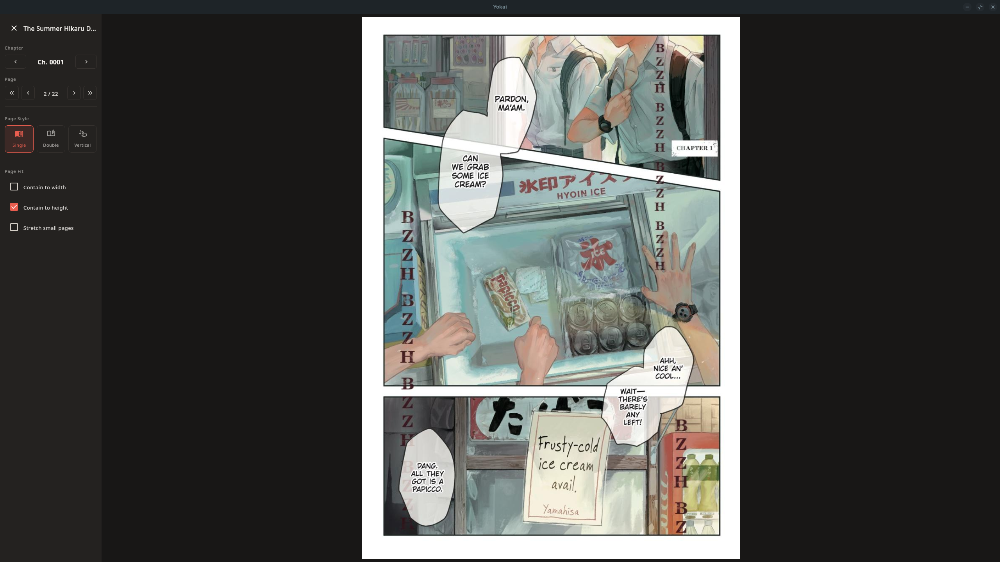
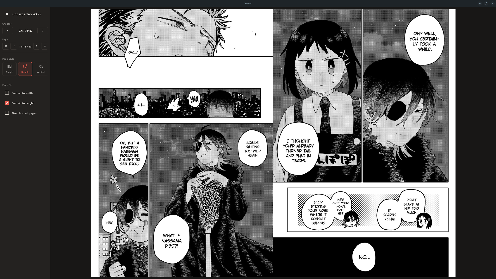
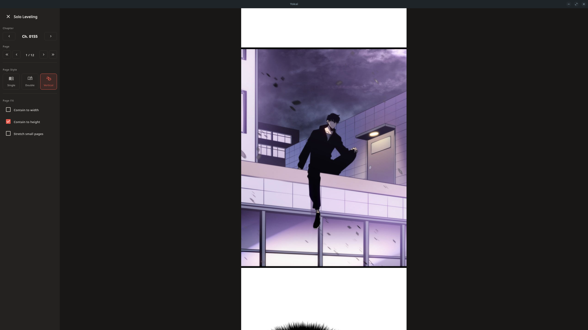

# Yokai


Yokai is a free, open-source manga reader for your desktop.

## Features

- Local library management with automatic folder watching for new series and chapters
- CBZ/ZIP chapter reading with a fast, paginated reader
- Per-chapter read tracking and categories for organising your library
- AniList integration to keep your reading progress in sync
- Multiple themes, including light and dark modes with a pure-black option
- Customisable key bindings

## Screenshots

| Single page | Double spread |
|---|---|
|  |  |

| Double page | Vertical (webtoon) |
|---|---|
|  |  |
## Download

Yokai is available for Linux (AppImage), Windows (MSI) and macOS (DMG) from the [GitHub releases page](https://github.com/MoLP5776/yokai/releases).

## Building from source

Yokai is built with Kotlin and Compose Multiplatform for Desktop. Building requires JDK 21.

```bash
./gradlew run
```

To build a distributable package for your platform:

```bash
./gradlew createDistributable
```

## Data location

Settings, key bindings and extracted chapter caches are stored under `~/.config/yokai/`.

## License

Yokai is licensed under the [MIT License](LICENSE).